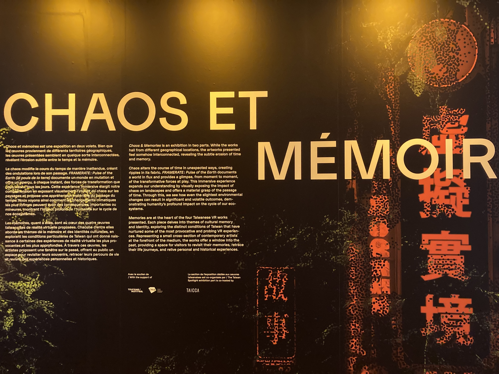

# Chaos et mémoire

# date de visite 
16 avril 2023

## lieu de mise en exposition
Centre PHI
Galeries 2 et 3
315, rue Saint-Paul Ouest
Montréal, Québec, H2Y 2A3

## type d'exposition
Temporaire, intérieur

## artiste
Craig Quintero (All That Remains), Fish Wang (Red Tail), Chen Singing (The Man Who Couldn’t Leave), Clément Deneux (MISSING PICTURES Episode 2: Tsai Ming-Liang, The Seven-Story Building)

## description de l'oeuvre
### All That Remains
"Nous trouvons un confort dans les «faits». Le soleil se lève à l'est. Il y a vingt-quatre heures dans une journée. J'existe. Ces truismes nous simplifient la vie et nous permettent de traverser le processus de la vie. All That Remains est une méditation sur la frontière poreuse entre rêve et réalité."

(source https://phi.ca/fr/evenements/chaos-et-memoires/)

### Red Tail
"Dans une gare flottant dans les nuages, une mystérieuse queue rouge attire l'attention d’un garçon. En poursuivant celle-ci, le garçon voyage à travers d'innombrables endroits magiques, rencontre des créatures étranges et finalement, il rencontre un homme courtois qui semble connaître ses secrets. Lorsque la queue rouge rappelle au garçon ses propres souvenirs et sa tristesse, quels sont les secrets cachés derrière elle et où vont-ils le mener? Inspirée de la bande dessinée du même nom de Wang, la mystérieuse queue rouge entraîne le public dans un voyage magique, créant une métaphore poétique des souvenirs d'enfance de chacun·e."

(source https://phi.ca/fr/evenements/chaos-et-memoires/)

### The Man Who Couldn’t Leave
"Entre les murs de l'ancienne prison de Green Island, le détenu politique A-Kuen raconte les histoires d'emprisonnement et de persécution survenues dans les années 1950 à Taïwan. Parmi ses codétenus, figés dans le temps, il raconte ses propres expériences et celles de son ami, A-Ching, qui n'a jamais réussi à s'en sortir. Découvrez l'époque, le lieu et l'attente dans l'espoir d'une chance de garder les histoires vivantes. The Man Who Couldn't Leave intègre les histoires de nombreuses victimes politiques de la Terreur blanche et les raconte sous la forme d'une lettre familiale non distribuée. Une expérience immersive sur l'espoir, la peur et la camaraderie."

(source https://phi.ca/fr/evenements/chaos-et-memoires/)

### MISSING PICTURES Episode 2: Tsai Ming-Liang, The Seven-Story Building
"Maître du «slow cinéma», le cinéaste taïwanais Tsai Ming-Liang n’a pas de «missing picture» à proprement parler. Ce qui le hante en revanche sont ses souvenirs d’enfance, si vivaces qu'il nous explique pourquoi il lui est impossible de les filmer, dans un vibrant hommage à ses grands-parents qui l'emmenaient chaque soir voir deux films au cinéma."

(source https://phi.ca/fr/evenements/chaos-et-memoires/)

## type d'installation
installation immersive en RV

## fonctionnement
On y retrouve 4 salle dans un corridor où qu'on retrouve des chaises et des lunnettes virtuelles. Lors les lunnettes mise on commence la vidéo/mini film. on a l'option de pivoté sur nous même avec les chaises pour avec une vue complètes de l'environnement. En sois c'est comme un cinéma en RV.

## mise en espace
il y a un corridor qui amène a quatre pièces différent ( chauqe pièces sont installé différemment) tous avec des lunnettes virtuelle, casque d'écoute et des chaises. certain fils des casque sont accroché au plafond

## composantes et techniques
* lunnette virtuelle
* casque d'écoute
* vidéo

## mise en exposition
* chaises
* fils
* cable
* crochets

## expérience vécus
chaque oeuvre était différente et touchaient des sujets difficile et émotionnelle. Tout au long de l'écoute des video en RV j'ai recu des vagues d'émotions. De plus les vidéos n'étaient pas trop longue donc le coté confort était correcte, pourtant quelque salle avais de plus comfortable chaise que d'autres. La pluparts des vidéo était triste et dépressive. on y retrouvais de la violance dans quelque s'une des videos.

## opinion

## site consulté
* image et description de l'ouvre prise du site du centre Phi
* https://phi.ca/fr/evenements/chaos-et-memoires/
